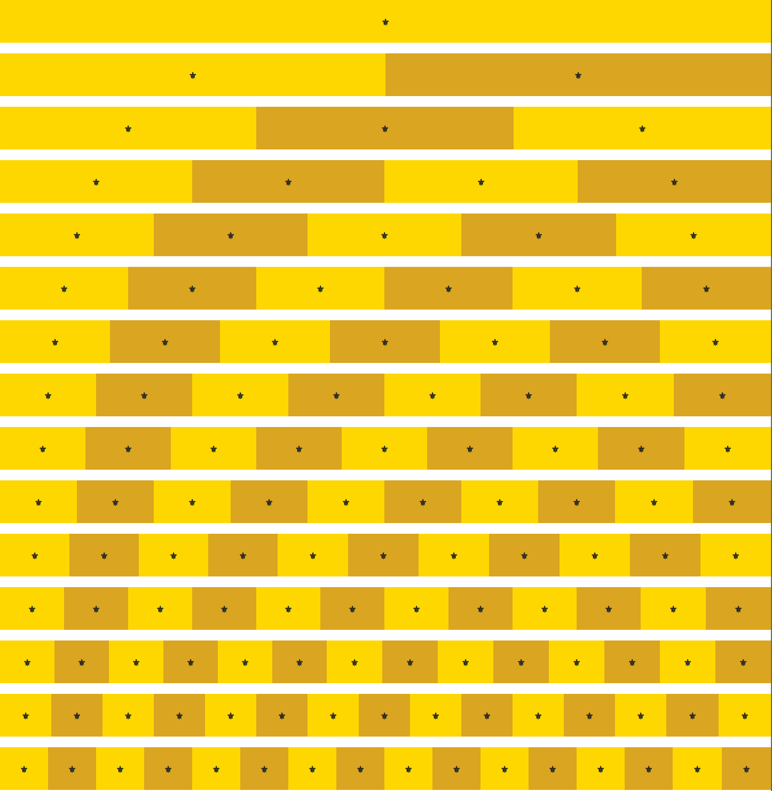

# ungrid [](http://badge.fury.io/bo/ungrid)

the simplest responsive css grid


## What's this?

__ungrid__ is a tiny, responsive, table-based CSS grid system. The entire `ungrid.css` file is 97 bytes minified.

```css
@media (min-width: 30em) {
    .row { width: 100%; display: table; table-layout: fixed; }
    .col { display: table-cell; }
}
```


## Get started

Install with [Bower](http://bower.io) `bower install ungrid` or just copy and paste the contents of ungrid.min.css into your CSS file.


## How to use

To use, simply put as many `.col`s as you wish in your `.row`s and the `.col`s will automatically be evenly spaced. This allows you to roll your own simple grids. [See it in action](http://codepen.io/chrisnager/pen/ypokv).

```html
<div class="row">
    <div class="col">⚜</div>
    <div class="col">⚜</div>
    <div class="col">⚜</div>
    …
    <div class="col">⚜</div>
</div>
```




## License

The MIT License (MIT)

Copyright (c) 2014 Chris Nager

Permission is hereby granted, free of charge, to any person obtaining a copy of
this software and associated documentation files (the "Software"), to deal in
the Software without restriction, including without limitation the rights to
use, copy, modify, merge, publish, distribute, sublicense, and/or sell copies of
the Software, and to permit persons to whom the Software is furnished to do so,
subject to the following conditions:

The above copyright notice and this permission notice shall be included in all
copies or substantial portions of the Software.

THE SOFTWARE IS PROVIDED "AS IS", WITHOUT WARRANTY OF ANY KIND, EXPRESS OR
IMPLIED, INCLUDING BUT NOT LIMITED TO THE WARRANTIES OF MERCHANTABILITY, FITNESS
FOR A PARTICULAR PURPOSE AND NONINFRINGEMENT. IN NO EVENT SHALL THE AUTHORS OR
COPYRIGHT HOLDERS BE LIABLE FOR ANY CLAIM, DAMAGES OR OTHER LIABILITY, WHETHER
IN AN ACTION OF CONTRACT, TORT OR OTHERWISE, ARISING FROM, OUT OF OR IN
CONNECTION WITH THE SOFTWARE OR THE USE OR OTHER DEALINGS IN THE SOFTWARE.
